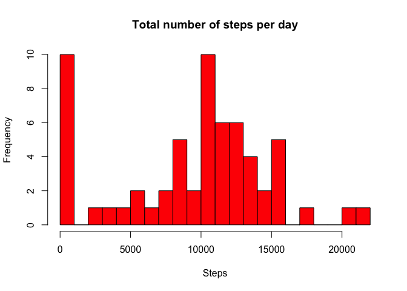

## Loading and preprocessing the data

```r
library(dplyr)
```

```
## 
## Attaching package: 'dplyr'
```

```
## The following objects are masked from 'package:stats':
## 
##     filter, lag
```

```
## The following objects are masked from 'package:base':
## 
##     intersect, setdiff, setequal, union
```

```r
library(lattice)

steps <- read.csv("./activity.csv")
steps$date <- as.Date(steps$date, format = "%Y-%m-%d")
```

## What is mean total number of steps taken per day?

```r
daily <- steps %>% group_by(date) %>% summarize(sum_steps = sum(steps, na.rm = T))
hist(daily$sum_steps, breaks = 20, col = "red", main = "Total number of steps per day", xlab = "Steps")
```

<!-- -->

Mean and median total steps taken per day

```r
mean(daily$sum_steps)
```

```
## [1] 9354.23
```

```r
median(daily$sum_steps)
```

```
## [1] 10395
```

## What is the average daily activity pattern?

```r
daily_interval <- steps %>% group_by(interval) %>% summarize(mean_steps = mean(steps, na.rm = T))
with(daily_interval, plot(interval, mean_steps, type = "l", main = "Average steps per intervals", xlab = "Interval", ylab = "Average daily steps"))
```

<!-- -->

Maximum number of steps on a given interval

```r
interval_max <- which.max(daily_interval$mean_steps)
interval_max
```

```
## [1] 104
```

```r
daily_interval[interval_max, ]$mean_steps
```

```
## [1] 206.1698
```
Interval 104 has maximum steps on average (206 steps)

## Imputing missing values
Number of missing values

```r
sum(is.na(steps))
```

```
## [1] 2304
```
### Impute missing values


```r
missing_values <- which(is.na(steps))
missing_values_imputed <- left_join(steps[missing_values, ], daily_interval, by = "interval") %>%
    mutate(steps = mean_steps) %>%
    select(-mean_steps) %>%
    ungroup(interval) 
```
Combine steps dataset (without missing values) with imputed values.

```r
steps_imputed <- rbind(steps[-missing_values, ], missing_values_imputed)
```

Histogram of daily steps. Also mean and median total number of steps taken per day.

```r
steps_imputed_daily <- steps_imputed %>% group_by(date) %>% summarize(sum_steps = sum(steps))
with(steps_imputed_daily, hist(sum_steps, breaks = 20, col = "red"))
```

<!-- -->

Mean and median total steps taken per day on imputed data

```r
mean(steps_imputed_daily$sum_steps)
```

```
## [1] 10766.19
```

```r
median(steps_imputed_daily$sum_steps)
```

```
## [1] 10766.19
```
Both mean and median seem to be a bit higher in the imputed data than in the original data. Imputing values using the mean interval steps seems to increase daily steps on average.

## Are there differences in activity patterns between weekdays and weekends?
Create new variable with values "weekday"/"weekend"

```r
steps_weekday <- steps_imputed %>% mutate(weekday = ifelse(
                weekdays(date, TRUE) %in% c("Sat", "Sun"),
                "weekend",
                "weekday")
)

avg_steps_weekday_interval <- steps_weekday %>% group_by(interval, weekday) %>% summarise(avg_steps = mean(steps))


xyplot(avg_steps ~ interval | weekday, data = avg_steps_weekday_interval, type = "l", layout = c(1,2), ylab = "Average number of steps")
```

<!-- -->


